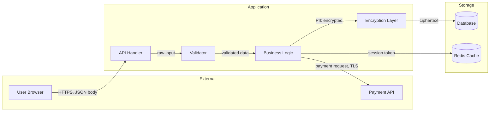

# Data Flow Mapping

Trace how data moves through the application from input to storage to output.
Identify trust boundary crossings, encryption/decryption points, serialization
steps, and data transformation operations. Produces annotated data flow maps
with security observations at each transition.

## Supported Flags

Read `../../shared/schemas/flags.md` for the full flag specification.

| Flag | Data Flow Behavior |
|------|--------------------|
| `--scope` | Default `full`. Data flow mapping requires broad visibility. Narrow scopes trace only flows touching scoped files. |
| `--depth quick` | Entry points and data stores only, no intermediate tracing. |
| `--depth standard` | Trace major data paths from input through processing to storage/output. |
| `--depth deep` | Full taint analysis: every transformation, validation, and boundary crossing. |
| `--depth expert` | Deep + annotate with threat categories, identify covert channels, DREAD scoring on flow weaknesses. |
| `--format` | Default `text`. Use `md` for Mermaid diagrams, `json` for structured flow graph. |

## Workflow

### Step 1: Determine Scope

1. Parse `--scope` flag. Default to `full` for comprehensive flow mapping.
2. Resolve to a concrete file list.
3. Prioritize: HTTP handlers, database access layers, external service clients,
   message queue producers/consumers, file I/O operations, cache layers,
   serialization/deserialization code, encryption modules.

### Step 2: Identify Data Sources (Origins)

Catalog every point where data enters the system:

| Source Type | What to Look For |
|-------------|-----------------|
| HTTP requests | Request body, query params, headers, cookies, path params, uploaded files |
| Database reads | Queries returning user data, config data, or cached content |
| External APIs | Responses from third-party services, webhook payloads |
| Message queues | Consumed messages from Kafka, RabbitMQ, SQS, etc. |
| File system | File reads, config loading, uploaded file processing |
| Environment | Environment variables, secrets managers, config services |
| User sessions | Session data, cached user state |

### Step 3: Identify Data Sinks (Destinations)

Catalog every point where data exits or is persisted:

| Sink Type | What to Look For |
|-----------|-----------------|
| Database writes | INSERT, UPDATE, ORM save/create operations |
| HTTP responses | Response body, headers, cookies set |
| External APIs | Requests to third-party services |
| Message queues | Published messages |
| File system | File writes, log files, exported data |
| Logs | Application logs, audit logs, error tracking |
| Browser | Rendered HTML, JavaScript context, DOM injection points |
| Email/SMS | Outbound notification content |

### Step 4: Trace Data Paths

For each source, trace data through the codebase to its sinks:

1. **Follow the variable**: Track the request parameter/input through function
   calls, assignments, and returns.
2. **Map transformations**: Record every operation applied to the data:
   - Validation (type checks, regex, allowlists)
   - Sanitization (HTML escaping, SQL parameterization, encoding)
   - Encryption/Decryption (note algorithm and key source)
   - Serialization/Deserialization (JSON parse, protobuf, pickle)
   - Aggregation (data combined with other sources)
   - Redaction (fields stripped or masked)
3. **Mark trust boundaries**: Note when data crosses between:
   - External network to application
   - Application to database
   - Application to external service
   - Frontend to backend
   - Service to service (in microservices)
   - User space to privileged operations

### Step 5: Annotate Security Properties

At each node in the data flow, annotate:

| Property | Values |
|----------|--------|
| **Encrypted** | In transit (TLS), at rest (AES/etc.), both, neither |
| **Validated** | Yes (with method), no, partial |
| **Sanitized** | Yes (with method), no |
| **Logged** | Yes (check for sensitive data in logs), no |
| **Access controlled** | Auth required, role checked, none |
| **PII/Sensitive** | Contains PII, financial, health, credentials, or other sensitive data |

### Step 6: Identify Flow Weaknesses

Flag security concerns at data flow transitions:

1. **Missing validation**: Data crosses a trust boundary without validation.
2. **Missing encryption**: Sensitive data transmitted or stored without encryption.
3. **Sensitive data in logs**: PII, credentials, or tokens written to log sinks.
4. **Deserialization of untrusted data**: `pickle.loads`, `JSON.parse` on unvalidated
   external input without schema validation, `ObjectInputStream` on network data.
5. **Trust boundary violations**: Internal-only data exposed to external sinks.
6. **Missing sanitization before output**: Data from untrusted source rendered in
   HTML, SQL, or shell command without appropriate encoding.
7. **Data retention issues**: Sensitive data persisted longer than necessary or
   without deletion mechanisms.
8. **Implicit trust**: Data from one service consumed by another without re-validation.

### Step 7: Generate Flow Diagrams

Produce Mermaid data flow diagrams:



Annotate edges with: protocol, encryption status, data sensitivity level.

### Step 8: Report

Output the data flow map with security annotations and any findings.

## Output Format

This skill produces a **data flow map** plus findings for flow weaknesses.

Finding ID prefix: **FLOW** (e.g., `FLOW-001`).

```
## Data Flow Analysis

### Summary
- Data sources identified: N
- Data sinks identified: N
- Trust boundary crossings: N
- Unvalidated crossings: N
- Sensitive data flows: N

### Data Flow Diagram
[Mermaid diagram]

### Flow Inventory

| # | Source | Path | Sink | Sensitivity | Encrypted | Validated | Issue |
|---|--------|------|------|-------------|-----------|-----------|-------|
| 1 | POST /api/login | -> auth.verify -> db.query | users table | Credentials | TLS only | Yes | None |
| 2 | POST /api/upload | -> fileHandler -> fs.write | /uploads/ | User files | No | No | FLOW-001 |

### Trust Boundary Crossings
[Table of all boundary crossings with security annotations]

### Findings
[Standard findings for flow weaknesses]
```

Findings follow `../../shared/schemas/findings.md` with:
- `metadata.tool`: `"data-flows"`
- `references.cwe`: `CWE-319` (Cleartext Transmission), `CWE-312` (Cleartext Storage),
  `CWE-532` (Info Exposure Through Log), `CWE-502` (Deserialization of Untrusted Data)

## Pragmatism Notes

- Not every data path needs encryption. Public data served over HTTPS is fine.
- Internal service-to-service calls over a trusted network or service mesh are
  lower priority than internet-facing flows.
- Focus on sensitive data flows first: credentials, PII, financial data, health data.
- Log redaction is important but severity depends on log access controls.
- At `--depth quick`, a high-level source-to-sink map is more useful than
  exhaustive intermediate tracing.
