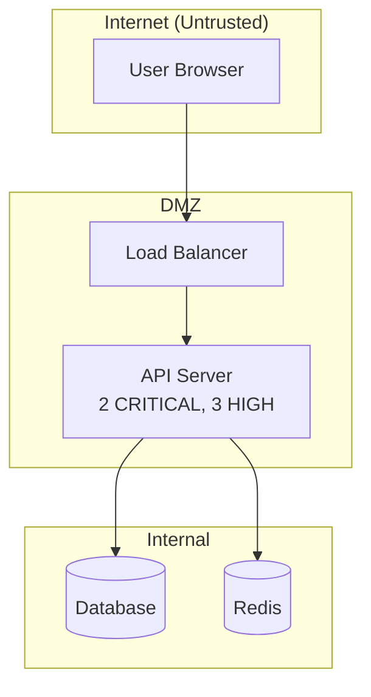

# Security Report Generation

Generate human-readable security reports from accumulated findings, scanner
results, and analysis data. Supports multiple output formats and includes
executive summaries, findings tables, architecture diagrams, scanner
coverage analysis, and remediation progress tracking.

## Supported Flags

Read `../../shared/schemas/flags.md` for the full flag specification.

| Flag | Report Behavior |
|------|----------------|
| `--scope` | Determines which findings to include. Default `full` (all findings). |
| `--depth quick` | Findings table and severity counts only. |
| `--depth standard` | Full report: executive summary, findings table, remediation status. |
| `--depth deep` | Standard + architecture diagram, attack paths, scanner coverage analysis. |
| `--depth expert` | Deep + risk scoring, trend analysis, compliance mapping, remediation timeline. |
| `--severity` | Only include findings at or above this severity in the report. |
| `--format` | Default `md`. Supports `md`, `html`, `json`, `sarif`. |
| `--output` | Custom filename for the report. Default: `.appsec/reports/report-<timestamp>.<ext>`. |

## Workflow

### Step 1: Gather Data

Collect all available security data:

1. **Findings**: Read `.appsec/findings.json`. Parse each finding object from the array.
2. **Fixed history**: Read `.appsec/fixed-history.json` if it exists.
3. **Scanner results**: Check for raw scanner output in `.appsec/scanners/`.
4. **Model data**: Check `.appsec/model/` for threat model artifacts.
5. **Previous reports**: Check `.appsec/reports/` for trend comparison.

Filter findings by `--scope` and `--severity` flags.

### Step 2: Compute Statistics

Calculate aggregate metrics:

1. **Total findings** by severity: critical, high, medium, low.
2. **Findings by status**: open, fix-applied, verified-fixed, fix-failed, false-positive.
3. **Findings by category**: Group by CWE, OWASP category, or tool.
4. **Remediation rate**: Percentage of findings that have been fixed and verified.
5. **Mean time to fix**: Average time between finding creation and verified-fix (if timestamps available).
6. **Scanner coverage**: Which scanners ran, which were missing, which categories were checked.

### Step 3: Generate Executive Summary

Write a concise (3-5 sentence) executive summary covering:

1. Overall security posture assessment (critical/concerning/moderate/good).
2. Most significant risk(s) found.
3. Remediation progress.
4. Recommended priority action.

Example:
```
The application has a **concerning** security posture with 2 critical and 5 high
severity findings across authentication and injection categories. The most
significant risk is unauthenticated access to the admin API (AC-001), which
allows full data exfiltration. 40% of findings have been remediated. Priority
action: fix AC-001 and INJ-003 before the next release.
```

### Step 4: Build Findings Table

Create a sortable findings table:

```markdown
| ID | Severity | Title | File | CWE | Status | OWASP |
|----|----------|-------|------|-----|--------|-------|
| AC-001 | CRITICAL | Unauthenticated admin API | src/routes/admin.ts:15 | CWE-306 | Open | A01 |
| INJ-003 | CRITICAL | SQL injection in search | src/db/search.ts:42 | CWE-89 | Fix Applied | A03 |
| ... |
```

Sort by: severity (critical first), then status (open first).

### Step 5: Generate Architecture Diagram

At `--depth deep` and above, generate a Mermaid diagram showing:

1. **Components**: Services, databases, external APIs, message queues.
2. **Trust boundaries**: Internet-facing vs internal, authenticated vs public.
3. **Finding locations**: Annotate components with finding counts and max severity.
4. **Data flows**: Show where sensitive data travels between components.



### Step 6: Map Attack Paths

At `--depth deep` and above, identify and document attack paths -- chains of
findings that combine to enable a more severe attack:

```
### Attack Path 1: Unauthenticated Data Exfiltration
1. AC-001: No auth on admin API (CRITICAL)
2. INJ-003: SQL injection in search endpoint (CRITICAL)
   Combined impact: Unauthenticated attacker can extract entire database
   via admin search endpoint with injected query.
```

### Step 7: Scanner Coverage Analysis

Document which security scanners were used and their coverage:

```
### Scanner Coverage

| Scanner | Status | Categories Covered |
|---------|--------|--------------------|
| semgrep | Ran | Injection, Auth, SSRF |
| gitleaks | Ran | Secrets |
| npm audit | Ran | Dependencies |
| trivy | Not available | Container, IaC |
| bandit | Not applicable | Python (not in stack) |

Coverage: 6/10 OWASP categories checked by at least one scanner.
Gaps: A04 (Insecure Design), A05 (Misconfig), A08 (Integrity), A09 (Logging)
```

### Step 8: Remediation Progress

Track fix progress over time:

```
### Remediation Progress

Total findings: 15
- Open: 7 (47%)
- Fix applied (unverified): 3 (20%)
- Verified fixed: 4 (27%)
- False positive: 1 (7%)

By severity:
- Critical: 0/2 fixed (0%) -- URGENT
- High: 2/5 fixed (40%)
- Medium: 2/5 fixed (40%)
- Low: 1/3 fixed (33%)
```

### Step 9: Write Report File

Assemble all sections and write to the output file.

#### Format-Specific Behavior

| Format | Output |
|--------|--------|
| `md` (default) | Write to `.appsec/reports/report-<timestamp>.md`. Sections: Executive Summary, Findings Table, Architecture Diagram, Attack Paths, Scanner Coverage, Remediation Progress, Appendix. |
| `json` | Aggregate findings object from `../../shared/schemas/findings.md` with report metadata. |
| `sarif` | SARIF 2.1.0 compliant output for GitHub Security tab. Schema: `sarif-schema-2.1.0.json`, driver name `appsec`. |
| `html` | Markdown report wrapped in minimal HTML with inline CSS. Mermaid diagrams rendered via script tag. |

## Output Format

The report itself is the primary output. Findings within the report follow `../../shared/schemas/findings.md`.

- `metadata.tool`: `"report"`

Finding ID prefix: This skill does not generate new findings. It aggregates existing ones.

## Pragmatism Notes

- If no findings exist, generate a clean report stating no issues found and which analysis has been performed.
- SARIF output should validate against the SARIF 2.1.0 schema. Test with `sarif-tools` or GitHub upload if available.
- Architecture diagrams are best-effort based on available code analysis. Label them as approximate.
- Do not fabricate statistics. If timestamps are missing, omit time-based metrics rather than guessing.
- For large codebases with many findings, group by component/service rather than listing all in one flat table.
- Always note the scope and depth used, so readers understand the report's coverage limitations.
