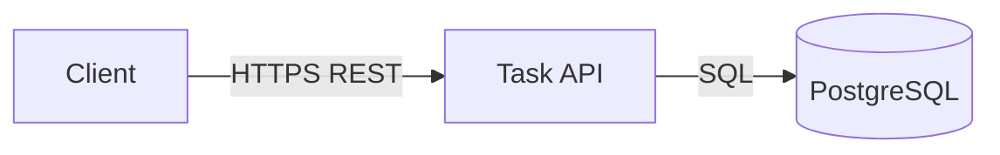

# 3. System Scope and Context

<!-- arc42-meta section:03 provenance:derived confidence:high -->

## 3.1 Business Context

The task-list API interacts with the following external systems:

| Neighbour | Direction | Interface |
|---|---|---|
| HTTP Client (browser/mobile) | in | REST/JSON over HTTPS |
| PostgreSQL | out | TCP/5432, SQL |

## 3.2 Technical Context

<!-- claim:context-db -->
The only persistent store is PostgreSQL, inferred from `src/db.js`.
