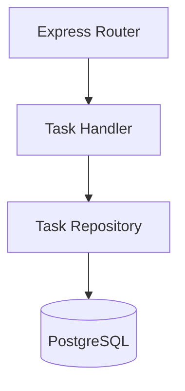

# 5. Building Block View

<!-- arc42-meta section:05 provenance:derived confidence:high -->

## Level 1: Whitebox System

## Components

| Block | Source | Responsibility |
|---|---|---|
| Express Router | `src/index.js` | HTTP routing |
| Task Handler | `src/handlers/tasks.js` | Request validation + response |
| Task Repository | `src/db.js` | SQL queries |

<!-- claim:block-router -->
The router is defined in `src/index.js`; it delegates to handler functions.
