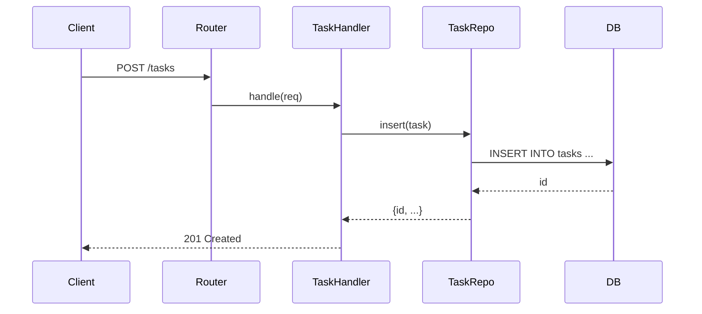

# 6. Runtime View

<!-- arc42-meta section:06 provenance:derived confidence:medium -->

## Scenario: Create Task

<!-- claim:runtime-create -->
The create-task flow is inferred from the `POST /tasks` route handler in `src/handlers/tasks.js`.
