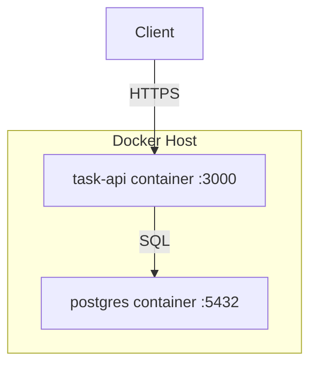

# 7. Deployment View

<!-- arc42-meta section:07 provenance:derived confidence:high -->

## Infrastructure

| Artifact | Source | Notes |
|---|---|---|
| task-api image | `Dockerfile` | Node.js 18 alpine, port 3000 |
| postgres | official image | PostgreSQL 15 |

<!-- claim:deploy-docker -->
The deployment topology is derived from the `Dockerfile` in the repository root.
The base image `node:18-alpine` and `EXPOSE 3000` are present in the Dockerfile.
