# Create Professional Mermaid Diagrams for Software Development

## Objective

Generate clean, maintainable Mermaid diagram code that renders professional software architecture
diagrams, flowcharts, sequence diagrams, and more. Diagrams should be version-controllable, easy
to update, and clearly communicate system design.

---

## ⚠️ Critical Requirements

1. **Start with diagram type declaration** on the first line (e.g., `flowchart TD`, `sequenceDiagram`, `classDiagram`).
2. **Use `%%` for comments** to explain complex sections.
3. **Use self-explanatory identifiers** (not `A`, `B`, `C`) for nodes.
4. **Keep diagrams focused**: one concept per diagram; split large diagrams.
5. **Maximum complexity**: ~15-20 nodes before splitting into multiple diagrams.
6. **Store as `.mmd` files** alongside code for version control.

---

## Diagram Type Selection Guide

| Use Case | Diagram Type | Direction |
|----------|--------------|-----------|
| System architecture, component relationships | `flowchart` | `TD` (top-down) or `LR` (left-right) |
| API interactions, message flows | `sequenceDiagram` | Automatic (time-based) |
| Domain models, OOP design | `classDiagram` | Automatic |
| Database schemas | `erDiagram` | Automatic |
| State machines, lifecycle | `stateDiagram` | Automatic |
| Project timelines | `gantt` | Automatic |

---

## Step-by-Step Instructions

### Step 1: Define Diagram Purpose

Choose one:
- [ ] System architecture (components + connections)
- [ ] API/request flow (sequence diagram)
- [ ] Data model (class/ER diagram)
- [ ] Process workflow (flowchart)
- [ ] State transitions (state diagram)

### Step 2: Choose Diagram Type & Direction

```mermaid
%% Flowchart directions:
flowchart TD    %% Top-down (most common)
flowchart LR    %% Left-right (good for processes)
flowchart BT    %% Bottom-top
flowchart RL    %% Right-left

%% Other diagrams auto-direction:
sequenceDiagram   %% Time-based (left to right)
classDiagram      %% Automatic hierarchy
erDiagram         %% Automatic relationships
```

### Step 3: Define All Nodes First (Best Practice)

**✅ DO** — Introduce nodes with descriptive identifiers:

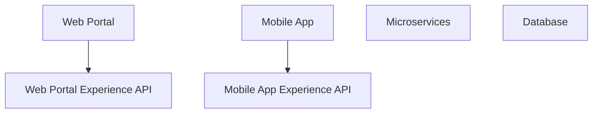

**❌ DON'T** — Mix definition with connections:

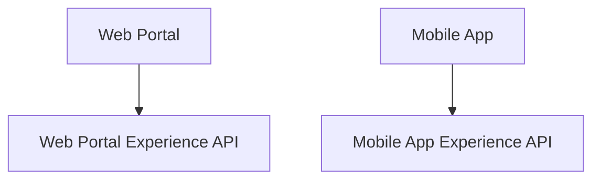

### Step 4: Use Self-Explanatory Identifiers

**✅ DO**:

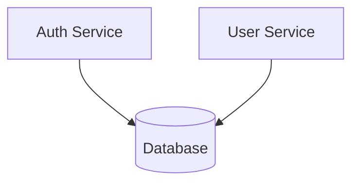

**❌ DON'T**:


### Step 5: Define Connections with Labels

```mermaid
%% Basic connection
A --> B

%% With label (use pipes)
A -->|label text| B

%% Different arrow styles
A --> B      %% Solid arrow
A -.-> B     %% Dotted line
A ==> B      %% Thick arrow
A -.- B      %% Dotted without arrow

%% With text label
A -->|POST /login| B
A -->|200 OK| B
```

### Step 6: Use Node Shapes for Clarity

```mermaid
flowchart TD
  A[Hard text]        %% Rectangle (default)
  B(Round edge)       %% Rounded rectangle
  C([Stadium])        %% Stadium shape
  D{Decision}         %% Diamond (for decisions)
  E[(Database)]       %% Cylinder (database)
  F[/Input or Output/] %% Parallelogram
  Start([Start])      %% Circle (start/end)
```

### Step 7: Add Subgraphs for Logical Grouping

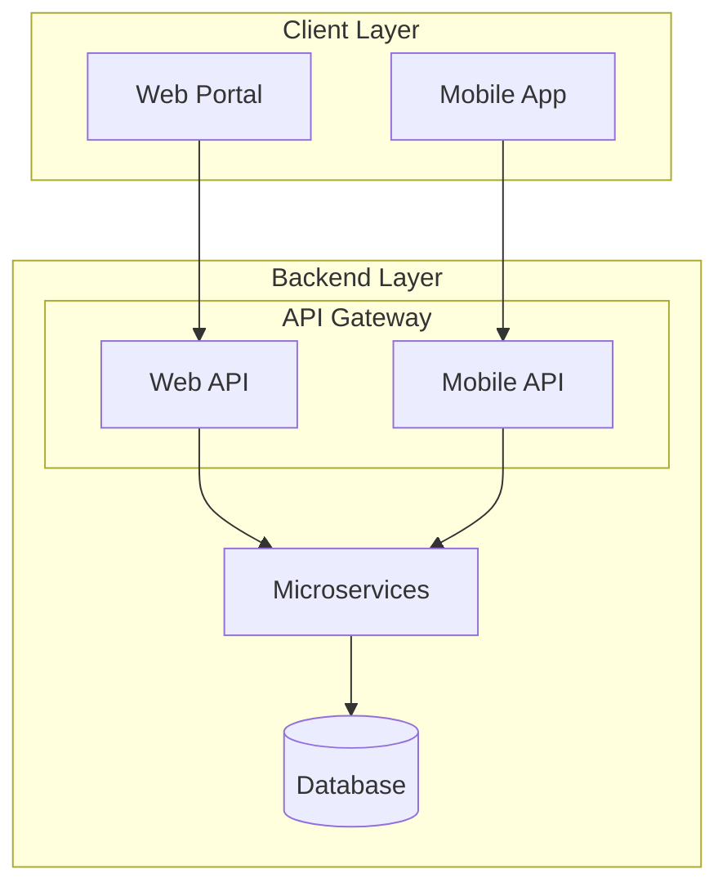

### Step 8: Add Comments for Complex Flows

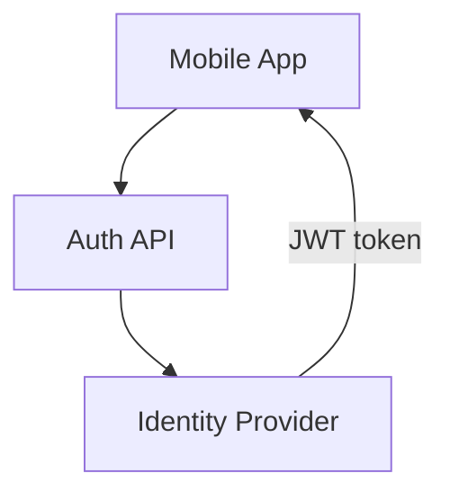

### Step 9: Handle Shared Nodes Properly

**✅ DO** — Define shared node on its own line:

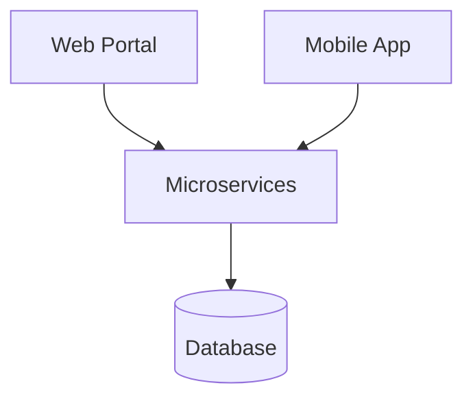

**❌ DON'T** — Repeat shared node:


---

## Diagram Type Syntax Guides

### A. Flowchart (System Architecture)

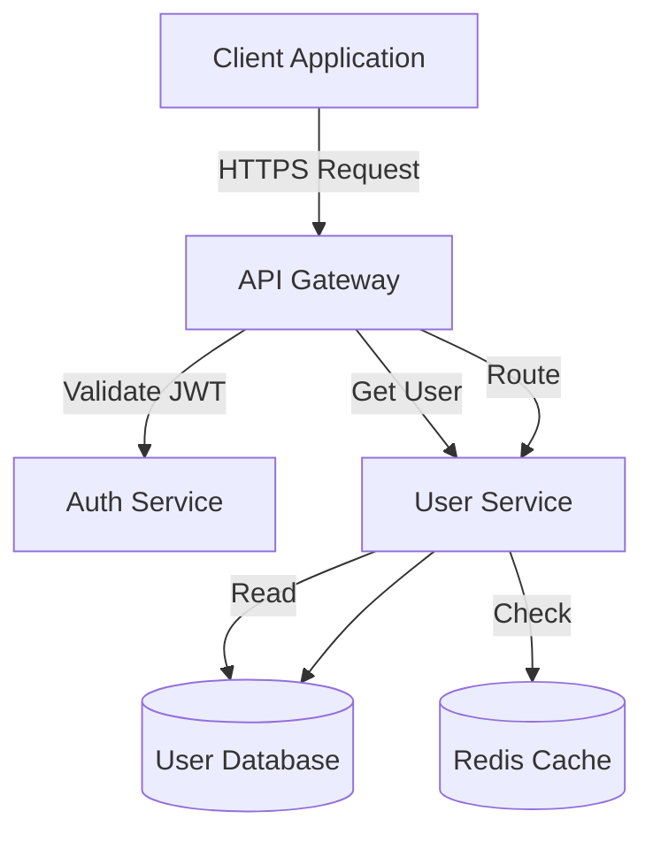

### B. Sequence Diagram (API Flow)

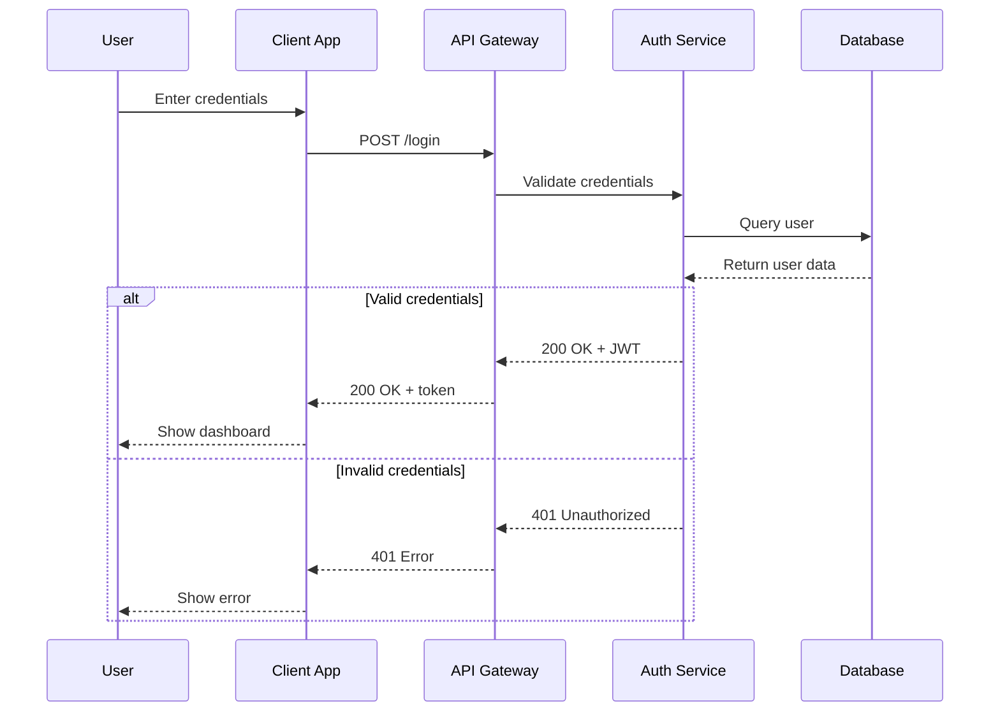

### C. Class Diagram (Domain Model)

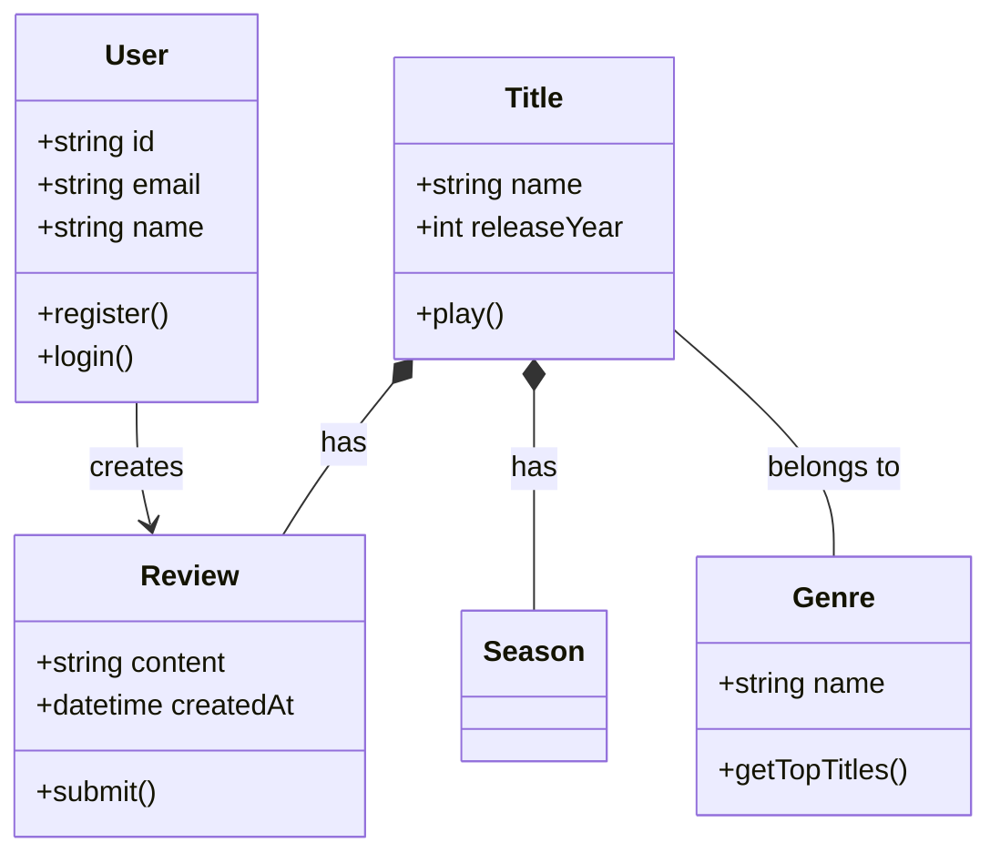

### D. Entity Relationship Diagram (Database Schema)

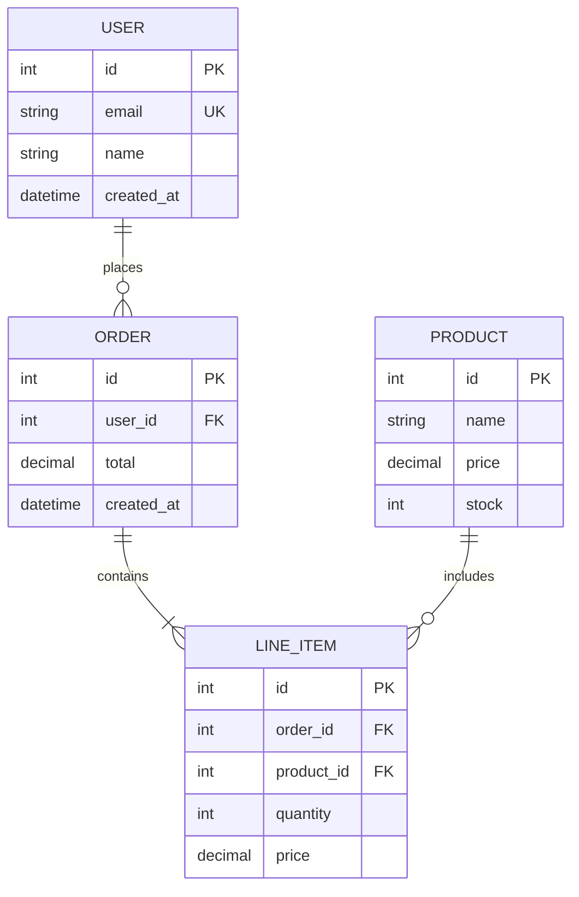

### E. State Diagram (State Machine)

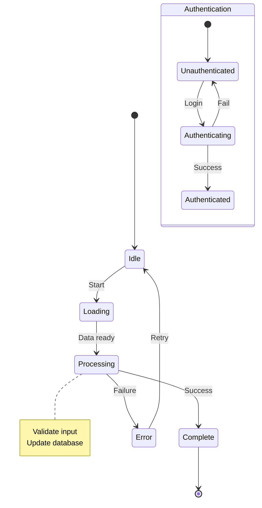

---

## Styling & Configuration

### Add Theme Configuration

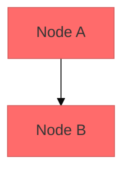

### Available Themes

- `default` — Standard blue/grey
- `forest` — Green tones
- `dark` — Dark mode
- `neutral` — Grey tones
- `base` — Customizable

### Style Specific Nodes

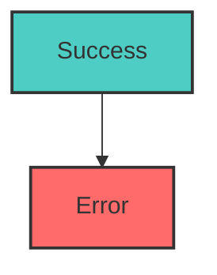

---

## Quality Checklist

Before finalizing, verify:
- ✅ Diagram type declared on first line
- ✅ All nodes defined before connections
- ✅ Self-explanatory identifiers (not A, B, C)
- ✅ Comments (`%%`) explain complex sections
- ✅ Subgraphs used for logical grouping
- ✅ ~15-20 nodes max (split if larger)
- ✅ Labels on arrows describe actions
- ✅ Test renders in Mermaid Live Editor

---

## Common Pitfalls

| ❌ Wrong | ✅ Right |
|----------|----------|
| `A --> B` with unclear `A`, `B` | `AUTHSERVICE[Auth Service] --> DATABASE[(Database)]` |
| No comments | `%% Auth flow validates JWT token` |
| One giant diagram | Split into `architecture.mmd`, `api-flow.mmd`, `data-model.mmd` |
| Missing node definitions | Define all nodes first, then connections |
| Using `#` in comments | Use `%%` not `#` for comments |

---

## When to Create Mermaid Diagrams

**Always diagram when:**
- Starting new projects/features
- Documenting complex systems
- Explaining architecture decisions
- Designing database schemas
- Onboarding new team members

**Reserve for:**
- Non-obvious flows
- Multi-service interactions
- Failure modes worth documenting
- Complex data relationships

---

**Now create your Mermaid diagram following these instructions.** Start by choosing the right
diagram type, define all nodes with descriptive identifiers, then add connections with clear
labels. Use comments and subgraphs to improve readability.
