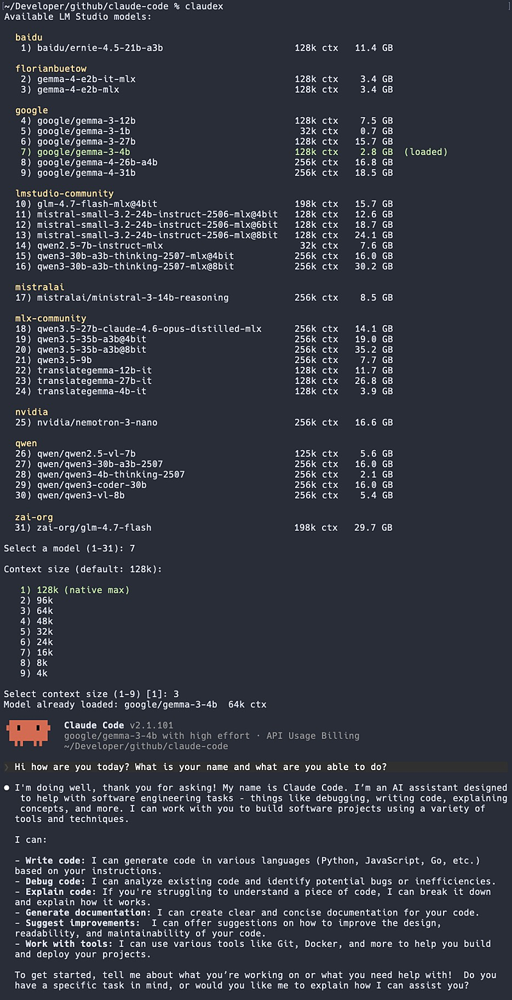

# claudex - Run Claude Code with Local LM Studio Models

A shell helper that lets you interactively pick a local LM Studio model and launch Claude Code against it. Models are listed grouped by publisher with size and context length info. Currently loaded models are highlighted. The selected model is auto-loaded before launching Claude and auto-unloaded afterwards (only if it wasn't already loaded).



## Prerequisites

- **LM Studio** with the `lms` CLI installed. Download from [lmstudio.ai](https://lmstudio.ai/download) and follow the [getting started guide](https://lmstudio.ai/docs/app/basics).
- **jq** for JSON parsing (`brew install jq` on macOS).
- **Claude Code** CLI installed and authenticated.

## Installation

1. Copy `claude-lmstudio.sh` somewhere on your machine, e.g. `~/scripts/`:

```sh
cp claude-lmstudio.sh ~/scripts/claude-lmstudio.sh
```

2. Source it from your `~/.zshrc` or `~/.bashrc`:

```sh
# Claude Code + LM Studio helper
[ -f "$HOME/scripts/claude-lmstudio.sh" ] && source "$HOME/scripts/claude-lmstudio.sh"
```

3. Reload your shell:

```sh
source ~/.zshrc
```

## Usage

Make sure the LM Studio server is running:

```sh
lms server start
```

Then run:

```sh
claudex
```

This will:

1. Check that `lms` and the LM Studio server are available.
2. List all downloaded LLM models, grouped by publisher, showing file size and max context length. Loaded models are highlighted in green.
3. Prompt you to select a model by number.
4. Auto-load the model if it isn't already loaded.
5. Set `ANTHROPIC_BASE_URL` and `ANTHROPIC_AUTH_TOKEN` and launch `claude --model <selected>`.
6. After you exit Claude, unset the environment variables and unload the model (only if it was loaded by `claudex`).
