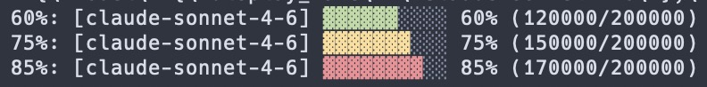

# Claude Code Context Status Bar

## About

Adds a colored context window progress bar to the Claude Code CLI status line. Shows the active model, a 10-block fill bar, and used/total token counts. Bar color reflects usage level:

- **Green** — below 70%
- **Yellow** — 70–79%
- **Red** — 80% and above



---

## Files

| File | Purpose |
|------|---------|
| `claude-context-status.sh` | Shell script executed by Claude Code on each status line refresh |
| `statusbar.jpg` | Screenshot used in this README |

---

## Installation

### 1. Copy the script to a permanent location

```bash
cp claude-context-status.sh ~/scripts/claude-context-status.sh
chmod +x ~/scripts/claude-context-status.sh
```

Use any stable path you prefer — the path is referenced in `settings.json` in the next step.

### 2. Add `statusLine` to `~/.claude/settings.json`

Open `~/.claude/settings.json` (create it if it does not exist) and add or merge the following top-level key:

```json
{
  "statusLine": {
    "type": "command",
    "command": "/Users/yourname/scripts/claude-context-status.sh"
  }
}
```

Replace the path with the actual absolute path where you placed the script. Tilde (`~`) expansion is not supported here — use the full path.

### 3. Reload Claude Code

The status line is read at session start. Either restart Claude Code or open `/hooks` in the CLI to trigger a config reload.

---

## How it works

Claude Code pipes a JSON object to the script on stdin at each status update. The script reads:

- `.model.display_name` — the active model name
- `.context_window.used_percentage` — integer 0–100
- `.context_window.context_window_size` — total context in tokens

It computes used tokens as `used_percentage * context_window_size / 100`, builds a 10-block bar (`▓` filled, `░` empty), applies ANSI color to the filled portion, and writes one line to stdout. Claude Code renders that line in the status bar.

### Color thresholds

| Usage | Color |
|-------|-------|
| < 70% | Green (`\033[32m`) |
| 70–79% | Yellow (`\033[33m`) |
| ≥ 80% | Red (`\033[31m`) |

Empty bar blocks are always dim gray (`\033[90m`). The model name and token counts are unstyled.

### Customization

- **Bar width:** change `BAR_WIDTH=10` to any integer
- **Color thresholds:** edit the `if` block that sets `FILL_COLOR`
- **Output format:** edit the final `echo -e` line

### Dependencies

- `bash`
- `jq` (must be on `PATH`)
