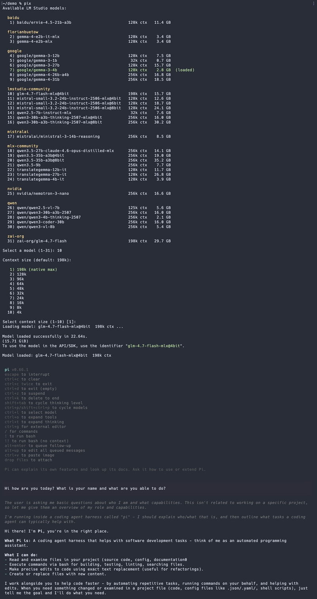

# pix - Run pi with Local LM Studio Models

A shell helper that lets you interactively pick a local LM Studio model and launch [pi](https://github.com/badlogic/pi-mono) against it. Models are listed grouped by publisher with size and context length info. Currently loaded models are highlighted. The selected model is auto-loaded before launching pi and auto-unloaded afterwards (only if it wasn't already loaded).



## Prerequisites

- **LM Studio** with the `lms` CLI installed. Download from [lmstudio.ai](https://lmstudio.ai/download) and follow the [getting started guide](https://lmstudio.ai/docs/app/basics).
- **jq** for JSON parsing (`brew install jq` on macOS).
- **pi** coding agent CLI installed (`npm i -g @mariozechner/pi-coding-agent`).

## How it works

Unlike Claude Code (which reads `ANTHROPIC_BASE_URL`), pi uses `~/.pi/agent/models.json` to configure custom endpoints. The script temporarily injects an `lmstudio` provider entry into that file pointing at `http://localhost:1234/v1`, launches pi with `--model lmstudio/<selected>`, then restores the original file on exit.

## Installation

1. Copy `pi-lmstudio.sh` somewhere on your machine, e.g. `~/scripts/`:

```sh
cp pi-lmstudio.sh ~/scripts/pi-lmstudio.sh
```

2. Source it from your `~/.zshrc` or `~/.bashrc`:

```sh
# pi + LM Studio helper
[ -f "$HOME/scripts/pi-lmstudio.sh" ] && source "$HOME/scripts/pi-lmstudio.sh"
```

3. Reload your shell:

```sh
source ~/.zshrc
```

## Usage

Make sure the LM Studio server is running:

```sh
lms server start
```

Then run:

```sh
pix
```

This will:

1. Check that `lms` and the LM Studio server are available.
2. List all downloaded LLM models, grouped by publisher, showing file size and max context length. Loaded models are highlighted in green.
3. Prompt you to select a model by number.
4. Prompt you to select a context window size (defaults to the model's native max).
5. Auto-load the model if it isn't already loaded.
6. Inject the `lmstudio` provider into `~/.pi/agent/models.json` and launch `pi --model lmstudio/<selected>`.
7. After you exit pi, restore the original `~/.pi/agent/models.json` and unload the model (only if it was loaded by `pix`).
